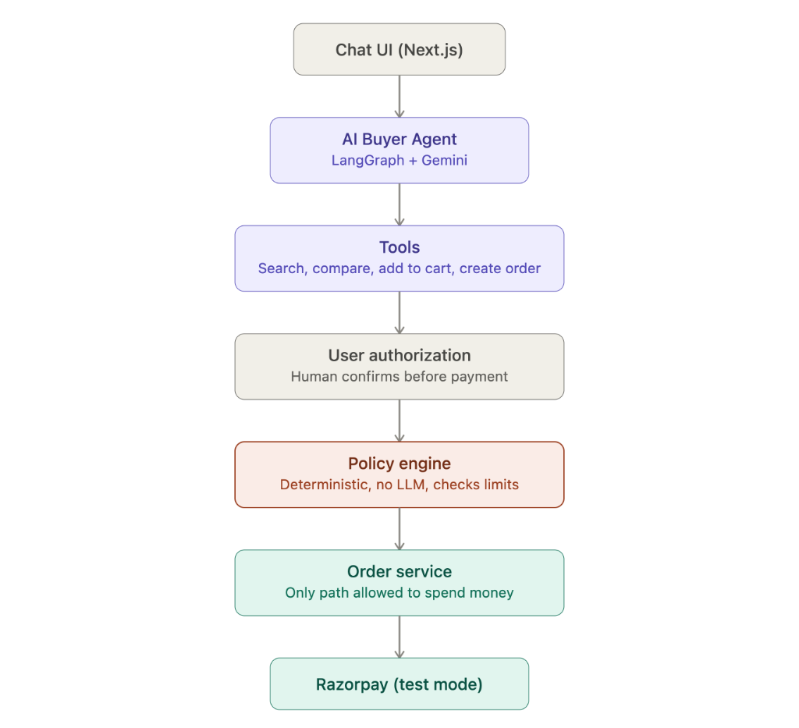
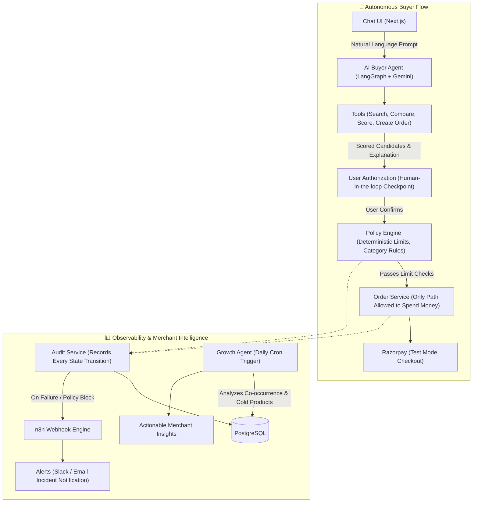

# 🛍️ Agentic Commerce Growth Engine

> **Autonomous AI Shopping with Deterministic Guardrails & Merchant Growth Intelligence**  
> Built for the **Razorpay Buildathon**

[](https://agentic-commerce-growth-engine.vercel.app/)
[](https://agentic-commerce-growth-engine.onrender.com)
[](https://n8n-production-b6ce.up.railway.app)
[](https://aistudio.google.com/)
[](https://razorpay.com/)

---

## 🌐 Live Deployments

| Service | Platform | Live URL | Purpose |
|---|---|---|---|
| **Frontend Web App** | Vercel | [agentic-commerce-growth-engine.vercel.app](https://agentic-commerce-growth-engine.vercel.app/) | Interactive Chat UI, Live Policy Controls, Inline Audit Log & Growth Dashboard |
| **Backend REST API** | Render | [agentic-commerce-growth-engine.onrender.com](https://agentic-commerce-growth-engine.onrender.com) | Django 6 + LangGraph Agent Pipeline, Policy Engine, Razorpay Integration |
| **Workflow Engine** | Railway | [n8n-production-b6ce.up.railway.app](https://n8n-production-b6ce.up.railway.app) | Incident Alerts (Slack/Email on failure) & Scheduled Merchant Growth Analytics |

---

## 🎯 The Problem & Our Solution

### 🛑 The Problem 
> **E-commerce is drowning in choice.**  
> A shopper wants a mechanical keyboard — they don't want to compare fifteen listings, read forty reviews, and second-guess a spec sheet.  
> 
> But if you hand an AI agent a shopping cart and a payment method, you've created a new problem: **how do you stop it from buying the wrong thing, overspending, or acting without permission?**  
> Most "AI shopping agent" demos skip that part entirely. **We didn't.**

### 💡 The Solution 
> We built an **Agentic Commerce Growth Engine**:
> 1. **Natural Language Discovery:** A buyer describes what they want in plain language.
> 2. **Deterministic Candidate Scoring:** An AI agent searches the catalogue and scores every candidate with a deterministic algorithm — *not a hallucinated LLM guess* — and explains exactly why it picked what it picked.
> 3. **Mandatory Human-in-the-Loop:** Nothing happens with money until a human explicitly clicks **Approve**.
> 4. **Zero-LLM Policy Engine:** Even after human approval, the transaction must pass through a strict rule-based policy engine (spending limits, category restrictions) that can still block the checkout.
> 5. **Full Audit Trail & Alerting:** Every single decision gets recorded to an immutable audit trail. Any failure or policy block immediately triggers an n8n webhook alert.
> 6. **Autonomous Merchant Growth:** On the merchant side, a second agent analyzes real order history to surface high-converting product bundles and inventory opportunities.

---

## 🏛️ System Architecture



### Architectural Flow



> **Unified Data Architecture:** All three systems (Agent, Audit, and Growth) read from and write to the same PostgreSQL database — **no separate data stores, just clean separation of concerns.**

---

## ⚡ Try It Live (Interactive Walkthrough)

Open the [Live Demo](https://agentic-commerce-growth-engine.vercel.app/) and test the full pipeline in under 60 seconds:

### 1. Natural Language Shopping
Type a query or tap a quick prompt:
* *"Find me a compact mechanical keyboard for software development under ₹8,000."*
* *"I need an ergonomic vertical mouse for long coding sessions."*

### 2. Transparent Scoring & Explanation
The agent runs a composite scoring formula:
$$\text{Score} = (\text{Price Fit} \times 0.40) + (\text{Customer Rating} \times 0.35) + (\text{Feature Overlap} \times 0.25)$$
You see **why** the product was recommended before any order is created.

### 3. Human-in-the-Loop Checkpoint
The LangGraph pipeline pauses execution at `request_confirmation`. The buyer must click **Approve Purchase** to resume state.

### 4. Test the Guardrails (Policy Engine)
* Use the **Spending Limit** slider on the UI to lower your budget (e.g., set to ₹2,000).
* Request a premium keyboard (₹7,999) and approve it.
* **Result:** The policy engine intercepts and **BLOCKS** the purchase before Razorpay is called. 
* The incident is immediately dispatched to n8n for failure alerting!

### 5. Merchant Growth Analytics
* Switch to the **Growth Engine** tab.
* The system computes frequent product co-occurrence (e.g., *CodeBoard 75% + PrecisionGlide Mouse* basket affinity) and surfaces low-velocity inventory with Gemini-generated merchandising strategies.

---

## 🔑 Key Engineering Innovations

| Feature | How We Built It | Why It Matters |
|---|---|---|
| **Zero-LLM Scoring** | Deterministic Python algorithm factoring budget alignment, star rating, and exact keyword matches. | Prevents LLM bias, hallucinations, and non-reproducible recommendations. |
| **Stateful LangGraph Checkpointing** | Persisted LangGraph thread states via `PostgresSaver`. | Allows execution to safely suspend waiting for human approval, surviving server restarts. |
| **Deterministic Policy Firewall** | Hardcoded logic checking user spending limits and category whitelists/blacklists. | LLMs can be prompt-injected; a deterministic policy engine cannot. |
| **Idempotent Razorpay Recovery** | UUID-based idempotency keys and state reconciliation for timeout recovery. | Network drops during checkout never result in double-charging or orphaned orders. |
| **Automated Incident Escalation** | Audit service triggers an async n8n webhook whenever an order fails or gets blocked. | Immediate operational visibility across Slack, email, or webhook receivers. |

---

## 💻 Local Development Setup

If you wish to run the entire stack locally with Docker Compose:

### Prerequisites
* [Docker Desktop](https://www.docker.com/products/docker-desktop/) (Docker & Compose)
* [Google Gemini API Key](https://aistudio.google.com/apikey)
* [Razorpay Test Account Key & Secret](https://dashboard.razorpay.com/app/keys)

### 1. Clone & Configure
```bash
git clone https://github.com/Vedant7077/agentic-commerce-growth-engine.git
cd agentic-commerce-growth-engine

cp .env.example .env
# Edit .env with your GEMINI_API_KEY, RAZORPAY_KEY_ID, RAZORPAY_KEY_SECRET
```

### 2. Launch with Docker Compose
```bash
docker compose up --build -d
```

### 3. Bootstrap & Seed Database
```bash
# Seed product catalogue, demo order patterns, and policy rules
docker compose exec backend python manage.py seed_all_if_empty
```

### 4. Access Local Services
* **Frontend**: [http://localhost:3000](http://localhost:3000)
* **Backend API**: [http://localhost:8000](http://localhost:8000)
* **n8n Automation**: [http://localhost:5678](http://localhost:5678) (`admin` / `changeme123`)

---

## 🛠️ API Reference

| Method | Endpoint | Description |
|---|---|---|
| `POST` | `/agent/start/` | Initiates natural-language search; returns scored product and thread ID |
| `POST` | `/agent/<thread_id>/confirm/` | Submits human approval (`approve: true/false`); triggers policy check & Razorpay |
| `GET` | `/products/` | Lists catalogue products with categories, prices, and stock |
| `GET` | `/accounts/limit/` | Retrieves current user spending limit |
| `POST` | `/accounts/limit/` | Updates buyer spending limit |
| `GET` | `/audit/events/` | Fetches audit log events across all pipeline nodes |
| `GET` | `/growth/analyze/` | Runs SQL basket affinity analysis & Gemini insight synthesis |

---

## ⚖️ Deliberate Engineering Scoping

In the interest of delivering a focused, production-grade architectural proof-of-concept, we made deliberate decisions on what **not** to build:

| Excluded Feature | Engineering Rationale |
|---|---|
| **Multi-User Auth / OAuth** | Demo runs as an active buyer (`user_id=1`). Adding auth boilerplate would add complexity without demonstrating the core agent → policy → payment pipeline. |
| **Live Payment Capture** | Razorpay is operated in **TEST mode**. Live money movement is a Razorpay dashboard switch, not an architectural code difference. |
| **Multi-Item Cart Checkout** | The agent focuses on single-item high-confidence recommendations. Multi-item cart expansion is purely additive. |
| **Vector Search / Embeddings** | Deterministic keyword and attribute matching was prioritized to keep candidate scoring completely transparent and explainable. |
| **Asynchronous Celery Queues** | LangGraph executes synchronously within the request cycle for predictable demo response times. In heavy-traffic production, this cleanly delegates to background workers. |

---

## 🏆 Buildathon Summary

* **Frontend:** Next.js (Tailwind CSS, React Markdown, Lucide Icons) hosted on **Vercel**
* **Backend:** Python 3.11, Django 6.1, Django REST Framework, LangGraph, LangChain hosted on **Render**
* **Database:** Managed PostgreSQL
* **Workflow Automation:** n8n deployed on **Railway**
* **AI Provider:** Google Gemini Flash
* **Payment Gateway:** Razorpay SDK (Test Mode)

Crafted with ❤️ for the **Razorpay Buildathon**.
